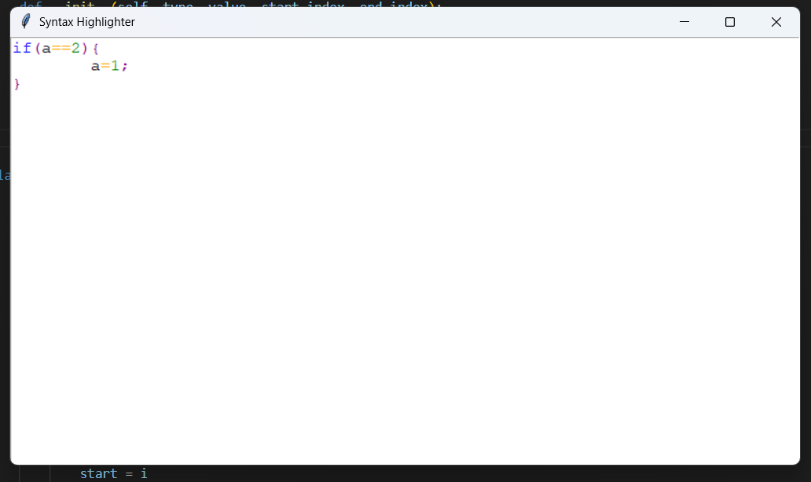

# Real-Time Grammar-Based Syntax Highlighter with GUI
# Real-Time-Grammar-Based-Syntax-Highlighter-with-GUI



# 🧠 Real-Time Syntax Highlighter with GUI (Python)

Bu proje, Programlama Dilleri dersi kapsamında geliştirilmiş bir gerçek zamanlı sözdizim denetleyici (syntax checker) ve renklendirici (syntax highlighter) uygulamasıdır. Uygulama, kullanıcı tarafından yazılan kodu anlık olarak analiz eder; hatalı yapıları vurgular ve geçerli token'ları türüne göre renklendirir. Projede hazır highlighting veya parsing kütüphaneleri **KULLANILMAMIŞTIR**.

---

## 🎯 Proje Hedefi

- Yazılan kodu tokenize etmek (lexical analysis)
- Token’ları gramer kurallarına göre analiz etmek (syntax analysis)
- Syntax hatalarını anlık olarak kullanıcıya göstermek
- Renkli ve sade bir kullanıcı arayüzü sunmak

---

## 🧱 Kullanılan Teknolojiler

- Python 3.x
- Tkinter (GUI)
- Elle yazılmış Lexical Analyzer (re kullanılmadan)
- Top-Down Recursive Descent Parser

---

## ⚙️ Temel Özellikler

- `if`, `assignment`, `expression` bloklarını tanır
- Gerçek zamanlı analiz: yazarken kontrol
- Hatalı blokları kırmızı arka planla vurgulama
- Renkli gösterim:
  - Keyword: Mavi
  - Değişken: Siyah
  - Sayı: Yeşil
  - Operatör: Turuncu
  - Ayraç: Mor
  - Hatalı yapı: Kırmızı arka plan


## 🚀 Uygulamayı Başlatmak

```bash
python main.py
```

---
